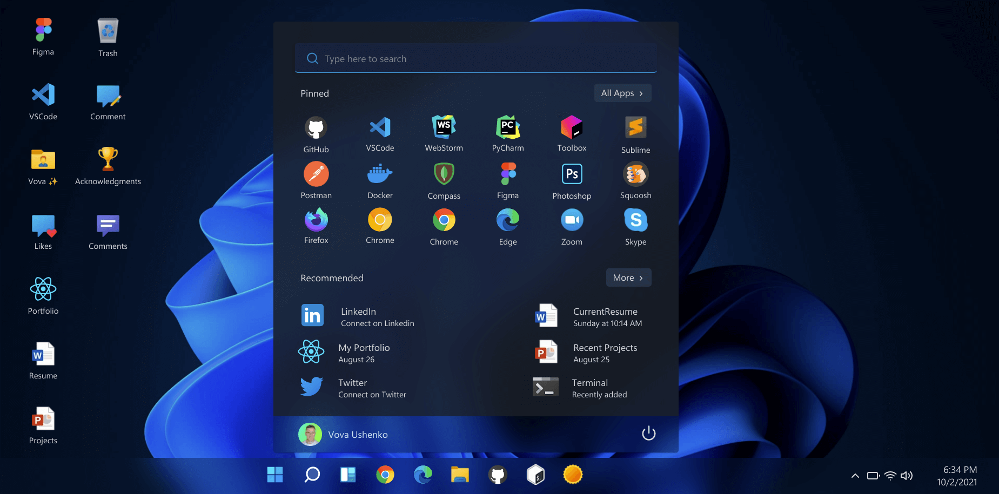
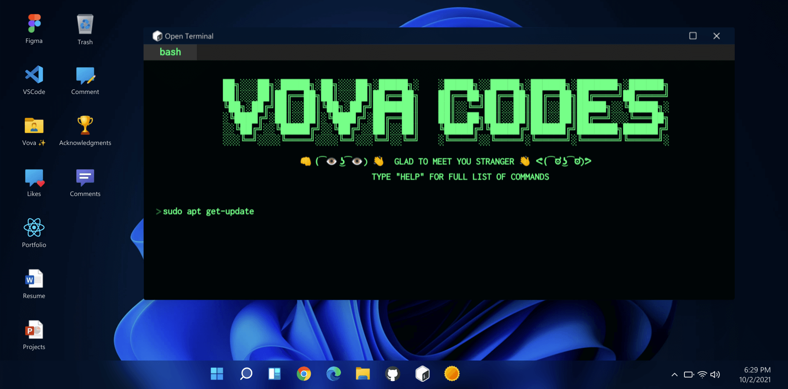

# ✨ TopDEV-fs | Portfolio ✨

#### 🔥 Try it online: [https://portfolio-topdev-fs-projects.vercel.app]

#### 🔥 If you really liked the project, consider giving it a star ⭐

#### Feel Free to connect and say hi on any platforms!

# Stack

- Next.js 🚀
- React ⚛
- Redux 🔥
- Styled-components 💅
- MongoDB 🍃

# At glance

## License

⚖️ MIT Copyright (c) 2021 Vova Ushenko
